# Memory

The Memory Game is a classic solo challenge of pattern recognition and recall. Starting with a set of cards laid out in rows, face down, the objective for the player is to uncover and match pairs of identical cards. In each move, the player flips over two cards. If the cards match in imagery,they do not flip back, if not they are flipped back over, and the player tries again. The game continues in this manner until all pairs are successfully matched. Success in the Memory Game is determined not just by luck but by the player's ability to remember the location of cards they've previously seen, making each decision a strategic one. The goal is to match all pairs in the fewest possible moves.

Once all cards are matched the user may choose to restart the game which will flip calll the cards and shuffle it again allowing for a multiple game experience.

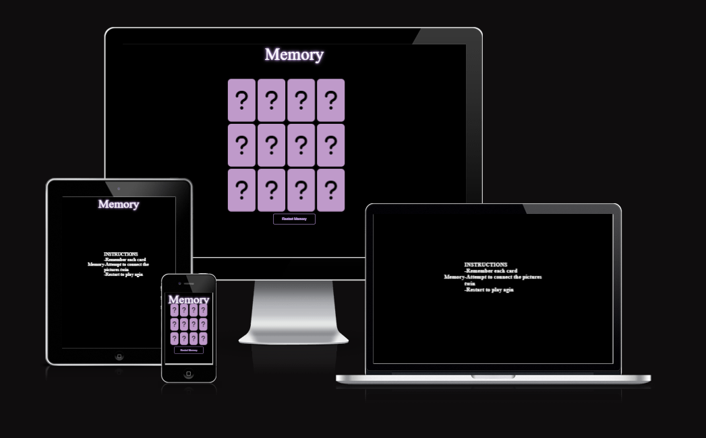

# Planning

## Users wants 
- As a user, I want to know how to play the game
- As a user, I want the game to be different each time
- As a user, I want to see a restart to allow each game to be different

## My Goals
- Users to have a fun game

# Features used to achieve goals
- I will firstly have it so the website is responsive to all screen-sizes.
- Having a startinf screen that shows instructions 
- Having a restart button that shuffles

# WireFrames

I created wireframes to showcase my project in a simplistic manner using Lucidchart. I will be creating a mobile, desktop and tablet screen size wireframe

## Mobile
- 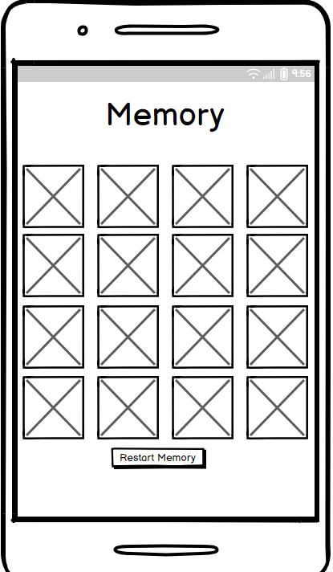

## Desktop
- 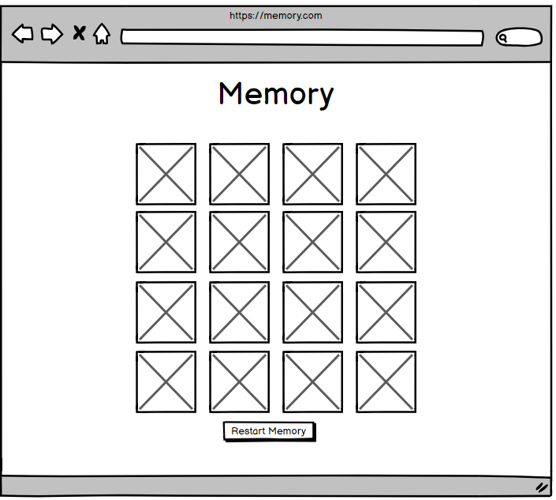

## tablet
- 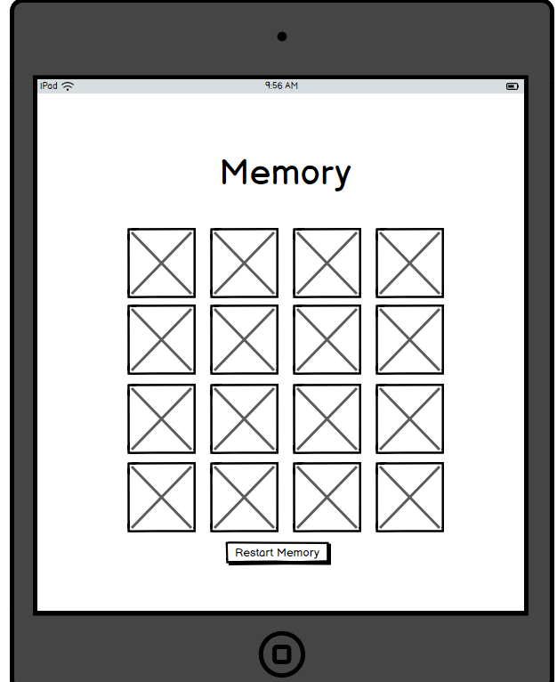

# Color
On my website, I initially opted for a purple textual content against a black history to acquire a exceptional evaluation. To further intensify this evaluation and make the text pop, I added purple shadows in the back of the text. This now not only amplified the difference but additionally delivered a layer of intensity, making the text greater visually charming. I decided to use color contrast https://shorturl.at/rzOSU to see combinations and opted for the AAA combination.

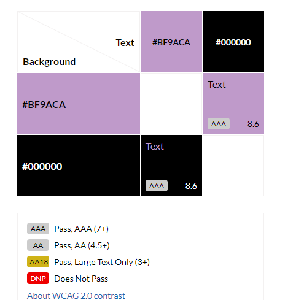

# Features
## Start screen
- Appears when you first load in and fade away when clicked. It shows the instructions of how to play the game in a simple but straight forward manner. 
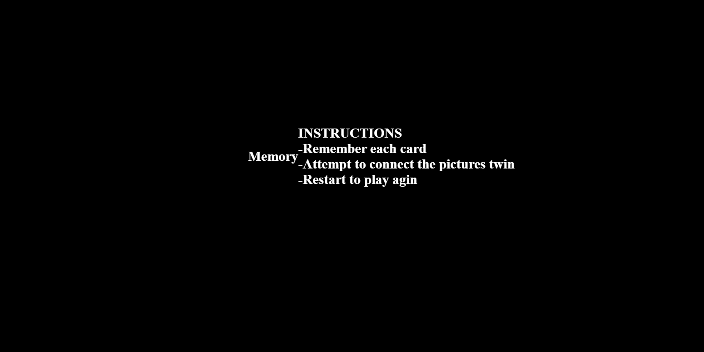

## Game 
- Upon clicking the start screen, users are immediately presented with the game's title, "Memory", enhanced by a shadow effect for emphasis. Displayed below the title is an interactive grid of 12 images, arranged in a 4x3 column, which players can click to flip.

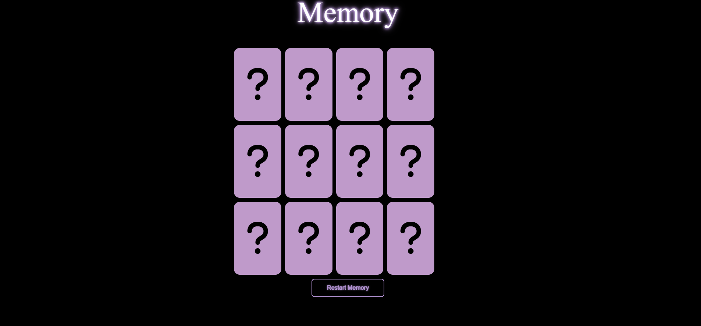

- When a card is flipped, it stays face-up until a second card is chosen. At this point, the system, powered by Java, determines if there's a match. If not, both cards revert to their face-down positions, challenging the player to remember the images and their locations for subsequent attempts.

- Successful matches stay visible, allowing the player to track their progress and focus on unmatched pairs. After successfully identifying all matching pairs, players have the option to restart, which shuffles the cards for a new challenge.

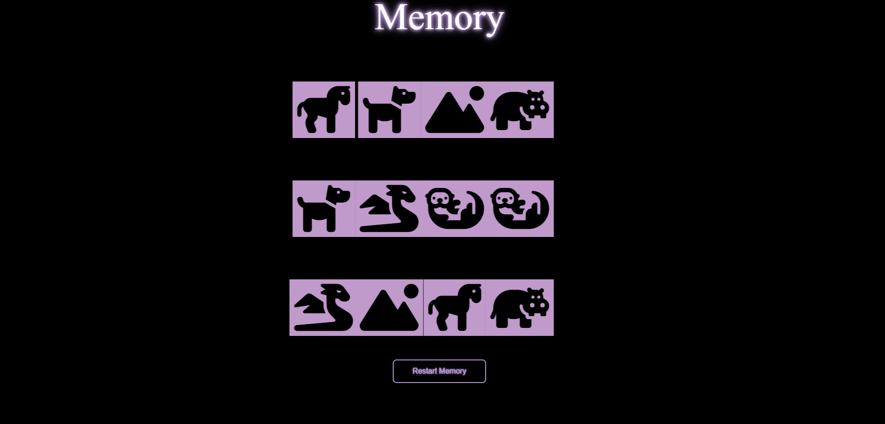

# Features left to implement
- Due to constraints on the development timeframe, several key features were left pending for future iterations of the game.

- Among these was the introduction of a move counter. This feature was designed to keep track of each action a player took, incrementing by a single count for every move, thereby allowing players to challenge themselves to complete the game in fewer steps.

- An essential addition was to be a game timer. This timer would start ticking as soon as the game began and would only stop when all 12 image pairs were successfully matched. This could add a sense of urgency and challenge for players seeking to beat their personal best times.

- To enhance user feedback and engagement, I had envisioned an animated shake effect that would be triggered every time players made an incorrect pairing, offering a more tactile response to their actions.

- One major upgrade in the pipeline was the option for players to progress to a higher level once they had successfully matched all 12 images. This progression system was aimed at retaining player interest and extending playtime.

- Furthermore, I had mapped out the inclusion of two additional levels, with each one ratcheting up the difficulty: In Level 2, players would be presented with an expanded grid featuring a larger number of images. Level 3 was set to be even more challenging; a dynamic timer would reshuffle all the cards every 30 seconds, pushing players to make matches more rapidly or risk losing their progress.

- To make the gameplay experience more social and competitive, a two-player mode was in the design phase. Here, participants would take turns, each trying to match image pairs, with the ultimate goal of outscoring the other in terms of successful matches.

- Lastly, a player-versus-computer mode was under consideration, providing solo players with an AI opponent. Different difficulty settings, ranging from easy to hard, would not only modify the AI's response speed but also vary the intrinsic challenges within the levels, offering tailored experiences for players of all skill levels.

# Testing

## Manual Testing 

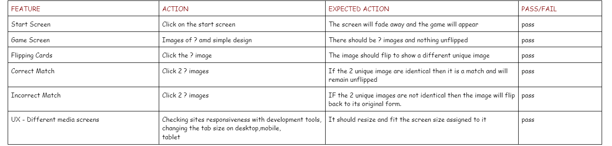

## Valitor Testing 
- HTML validtor came back with no issues

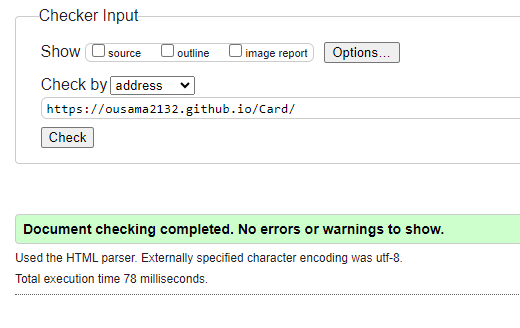

-Css validtor came back with no issues

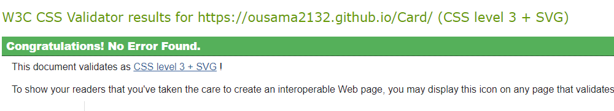

-Java's validtor came back with issue of ES6 version which i believe has nothing to do with my actual code

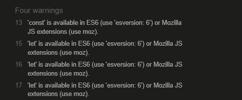

## LightHouse testing
- I am very satisfied with my lighthouse result but id like to increase my SEO 

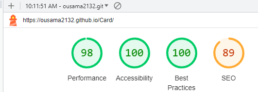

## Bugs
- In the journey of developing my project, I was fortunate not to come across bugs. However, this doesn't mean the path was entirely smooth. There were moments when I encountered code behaviors that seemed illogical or didn't align with my initial expectations. These inexplicable issues, while not bugs in the traditional sense, still posed significant challenges, threatening to disrupt the seamless functionality I aimed for. Rather than allowing these issues to escalate, I adopted a proactive approach. By diligently reviewing every line of my code and cross-referencing it with reliable online resources, especially W3Schools, I ensured that I was following best practices and standards. This consistent and thorough review process became my shield, allowing me to identify potential pitfalls before they morphed into bigger problems.

# Deployment
- Go to the Settings tab of your GitHub repo.
- On the left-hand sidebar, in the Code and automation section, select Pages.
- Make sure:
- Source is set to 'Deploy from Branch'.
- Main branch is selected.
- Folder is set to / (root).
- Under Branch, click Save.
- Go back to the Code tab. Wait a few minutes for the build to finish and refresh your repo.
- On the right-hand side, in the Environments section, click on 'github-pages'.
- Click View deployment to see the live site.

- I got this info from https://shorturl.at/hjS27 .

# Credits

## Content
- I reviewed many youtube videos to better understand how to approach my own memeory game, these were the videos I used 
https://youtu.be/ZniVgo8U7ek?si=Gt5Nwrf0zuco1yDP
https://youtu.be/M0egyNvsN-Y?si=1uL_XDNwNkXU59L3
https://youtu.be/-tlb4tv4mC4?si=q3GTohXPjbku28DB#
With these videos I was able to come to conclusion how similar each memory game i sand its approach, such as the same shuffle,match and cards functions.
- My main code took a lot of insperation from this as it takled all the features i wanted, 
https://shorturl.at/ayQY1
- Allowed me to design better buttons 
https://www.w3schools.com/css/css3_buttons.asp
- Allowed me to make cool header 
https://shorturl.at/dIU28
- Helped me add start screen
https://dev.to/saikatbishal/how-to-make-a-splash-screen-using-html-css-and-javascript-240m

## Media
- The favicon image came from
Memory - Free miscellaneous icons
- The icon images on the cards came from
https://fontawesome.com/icons
